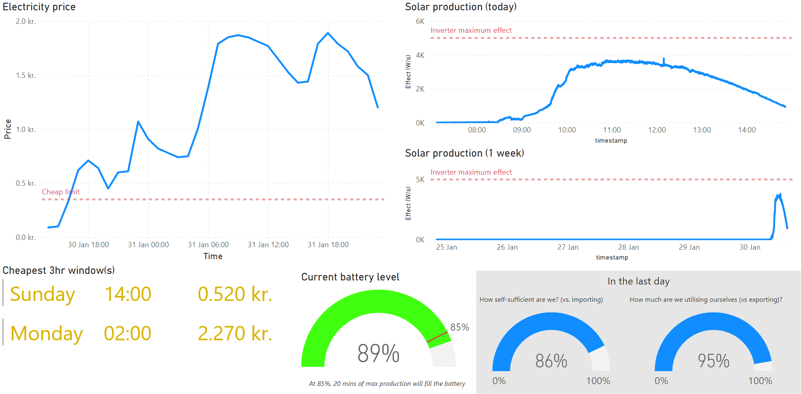

# PyElectricity
Small basic recorder tool for gathering up electricity stats and storing them in a recording DB.

My setup consists of:
- `Fronius Symo Hybrid 5.0-3-S` (5kW inverter)
- `20x MaysunSolar 310Wp panels` (approx. 6kW peak effect)
- `Smart Meter 63A` (electricity meter)
- `Datalogger module` (logger/uploader to Fronius)
- `LG Resu H` (9800Wh battery)
- `PostgreSQL 13` (database running via Docker)
- `Raspberry Pi 3b+` (executing the scripts, runs Raspbian Linux)

# Setup
There are three scripts:
- `solar_panels.py`, which will record data from the Fronius inverter and store it to a DB
- `power_prices.py`, which will grab power price data from Nordpool and store it to a DB
- `weather.py`, which will grab the weather forecast for your location from Openweathermap and store it to a DB
*make sure to create the DB tables first, there are creation scripts in the `sql` folder*

They're running in a Docker setup, and expect the following environment variables:
- `DB_HOST` - the database host
- `DB_PORT` - the database port
- `DB_USER` - the database username
- `DB` - the database
- `DB_PASS` - the database password
- `QUERY_FREQUENCY` - the query frequency for the intervert
- `THRESHOLD` - the threshold before a new query process is started (e.g. 60 when crontab scheduling every 5th minute)
- `INVERTERIP` - the inverter host
- `WEATHER_API` - the API key for [Openweather](https://openweathermap.org/api)
- `WEATHER_LAT` - the latitude to get the forecast for
- `WEATHER_LON` - the longitude to get the forecast for

For example: 
```docker run --rm -d -e "DB_HOST=192.168.x.x" -e "DB_PORT=5432" -e "DB_USER=user" -e "DB=db" -e "DB_PASS=password" -e "QUERY_FREQUENCY=5" -e "THRESHOLD=60" -e "INVERTERIP=192.168.x.x" -e "WEATHER_API=457894" -e "WEATHER_LAT=12.3456" -e "WEATHER_LON=12.3456" pyelectricity```

The docker image is available on [Docker Hub](https://hub.docker.com/repository/docker/antra/pyelectricity/general).

# Visualising
Currently, I am using PowerBI for visualisation/dasboarding; I am not certain if that will be the permanent setup or if I should create some visualisations (e.g. as png) and embed to a website.
This is what it looks like at present.  

